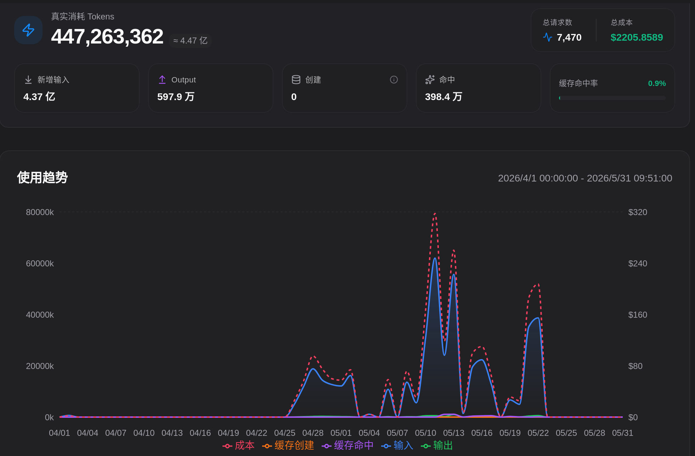

2026年初，openclaw 这类通用式架构的 agent 引起关注。进而，tokenmaxxing, ralph loop, autoresearch 等概念被付诸实践并广受吹捧，人们从未如此看好 LLM 的能力。事后来看，我也成为这样情绪中的一分子。


这篇文章或许本应是 autoresearch 的最佳实践分享，但实际上结果相当让人失望——即使有最好的模型（Opus 4.6）、合理的系统设计。因此，这篇文章最后是关于 autoresearch 和 tokenmaxxing 的一点反思。



## 实现了什么

所有必要的工具：
- Obsidian, Claude Code CLI
- [MinerU](https://github.com/opendatalab/mineru) ，一个 VLM 驱动的将 PDF/HTML 提取为 Markdown 的工具
- claude code plugin: [superpowers](https://github.com/obra/superpowers)
- obsidian plugin: custom attachment location, git
- obsidian CLI


主要参考：
- [ARIS](https://github.com/wanshuiyin/Auto-claude-code-research-in-sleep)，一个完全自动化论文生产系统
- 一篇[L站帖子](https://linux.do/t/topic/1969598)


我想实现的是：
1. 一套归档和检索策略，将论文和实验等转化为 obsidian 结构化文档，并可以检索；
2. 一个关系图谱，建立起论文、实验、idea 等实体之间的联系；
3. 一个 ideation 工作流，让 agent 借助知识库完成 idea 生成、评价和筛选；
4. 为了对接下游 agent，将 idea 转化为可执行计划。


文件结构大致如下：
```tree
├── CLAUDE.md				# 仓库说明，检索策略说明
├── paper_origin			# MinerU 提取的原论文 Markdown
├── paper_reading			# 手写的论文笔记
│   ├── archived
│   ├── notes
│   ├── overview
│   └── paper_index.md
├── Reading-Gata			# agent 整理的论文笔记
├── research_ideas			# 借鉴 ARIS 设计的 idea 目录
│   ├── _banlist.md			# 已经放弃的 idea
│   ├── _candidates.md		# 候选 idea
│   ├── claims
│   ├── _context_pack.md	# 知识库关键内容，便于加载进上下文
│   ├── ideas				# 所有 idea 目录
│   └── _index.md			# idea 索引
└── research_log			# 实验、计划、讨论记录
    ├── _current_plan.md
    └── discussions
```


简要介绍4个知识库 skill：
- `paper-reading`: 将 arxiv 论文提取 markdown 到 /paper_origin，然后读 markdown 文件并做笔记。笔记主要包括：论文综合评分；论文背景、问题、insight、方法、实验；贡献评估；关联笔记；TLDR快速介绍等。
- `build-context-pack`：读取知识库内容，提取研究方向、活跃论文、已有研究链条，总结结构性 Gap，未解决问题等，更新 `_context_pack.md` 文档
- `research-idea`：先发散探索 idea（迁移方法、寻找缺失环节、寻找矛盾等），并行产生大量后训。然后两轮 review-refine，根据评分筛选top-k，最后归档成为 idea 文档
- `research-contract`：将某一 idea 转化为可参照和验证的 contract，写明假设、预期、边界、成功/失败信号等。通过多 agent 进行 review，不断寻找并弥补缺失环节。

所有文档都有模板、属性、标签以便于检索。


笔记加载分为4层：`_index.md`和`_context_pack.md`给定核心信息，按标签加载，按属性和评分加载，以及直接读取论文原文。


在不到 2 个月内，知识库生产了60篇左右的论文笔记，以及若干 idea：


不论最后结果，在探索过程中也获得一些经验：

- 使用多 agent 并行不仅能节省上下文，也更适合快速完成重复性工作（如初步生成 idea）
- 不同模型具有明显的风格差异，在非标思考中很容易引进偏见。因此，使用不同模型（如 Opus 和 GPT）交叉审查是有必要的。
- 尽可能用可执行的、低层的动作来描述任务，而不是抽象的、高层的风格。contract 将 idea 具体化、可验证化，不仅对autoresearch 系统非常关键，对研究者自己的实践也有帮助。

## 何谓失败

上述设计实际上已经经过多轮尝试和改进。多 agent 并行，交叉审查，结构化的知识库文档，精细的标签和检索，这些都看起来非常合理。如果从自动化程度或是产量来说，可谓比较成功；然而，产出质量却非常让人失望。

- 论文评分形同虚设。无论在简单（3档）或还是复杂（5档多维加权）的标准下，几乎所有论文的评分都缺集中在同一档，依赖人工区分和挑选；
- 检索能力有限。尽管提供了多层检索方法，但 agent 不会有效利用，很难轻松找到知识库或外部有用的信息。
- idea 同质化，缺乏新意。在阅读一篇有关 jepa 的文章后，几乎所有被筛选留下的 idea 都要和 jepa 有关系。绝大多数 agent 想出的方法都是多篇论文方法的强行组合，或是在一个小问题上设计复杂的假设和实验。
- contract 脱离实际。agent 对实际实验环境（代码库、数据、计算资源）了解非常有限，无法给出合理的实验计划。

至此，我觉得与其继续修修补补，不如直接承认：在当前模型能力、工具和平台下，autoresearch 还远没有达到实际可用水平。


- 当前 LLM 的强大代理能力主要来自 RLVR。但是对于笔记和论文，没有客观的评价标准，没有清晰反馈，也就不能可控地提升模型能力。

- coding 场景有大量高质量数据，并且有一套公认的实践方法。相比之下，当我们询问关于读论文和构思 idea 方法，有经验的学者也往往落回抽象的 “taste”，缺少清晰的描述。
- skill 的形式看似泛用性很强，但在多步长程任务中效果大打折扣。高质量的 skill，例如 superpowers 系列, grill-me, 倾向于一个 skill 只实现一个原子任务。ideation 这样的任务，每一步有完全不同的标准和目标，让指令遵循质量明显下降。随着复杂度提高，更细粒度的 hook 和上下文管理是必要的。

- 成熟的 “taste” 需要在构思-实验-记录的闭环中形成，这需要一个更复杂的系统。让 agent 能在单个环境里实现跑代码（云端）、写笔记（本地）、网页搜索，同时还要让人也能实时查看和编辑，不仅要解决多端环境问题，还让任务上下文成倍复杂。


更重要的是，agent 的研究并不能替代真人的研究。当一篇论文能够用一句 `/read-paper <arxiv-id>`解决的时候，读论文的耐心将逐渐消失。忙于建造并不现实的“论文工厂”，便会荒废动手和反思的能力。


不是所有工作都*应该*由 agent 自动化。我们或许不再需要考虑人和 LLM 的区别，但是依然需要考虑*自我*和*他人*的区别。审读论文、提出有价值的问题、设计合理的假设和实验，可以说是一个 ai 研究者的核心技能，自动化这些技能如同主动放弃一部分竞争力。

## autoresearch 的未来

当我开始构思这个项目时，openclaw, Opus 4.6, 正掀起前所未有的 FOMO 情绪，LLM 最狂热的使用者们谈论着 tokenmaxxing，产出一个个光鲜的概念，期待用超级智能改变整个工作流。当我写下这些文字时，曾大规模推崇 tokenmaxxing 的扎克博格表示对 agent 发展未达预期，LLM 价格指数开始回调，许多公司用完里一年的 AI 工具预算。LLM 在代码方面的成功，让我们认为它已经拥有足够通用的智能。但是对于非标思考、长程任务、极其丰富的上下文，LLM 依然远非可用。


LLM 和 agent 的能力边界依然在不断扩展，有朝一日 autoresearch 将不再是问题。期待有开源的成熟 autoresearch 系统，让一年10篇一作不是梦。不过，正如工业界比学术界更能推动 ai 的进步，一个真正有价值的 autoresearch 系统或许不该向“产出论文”的学术 taste 对齐。LLM 值得用在搭建后训练环境上，值得用在合成数据上，但不值得用在“讲故事”和模仿抽象的 taste 上。


